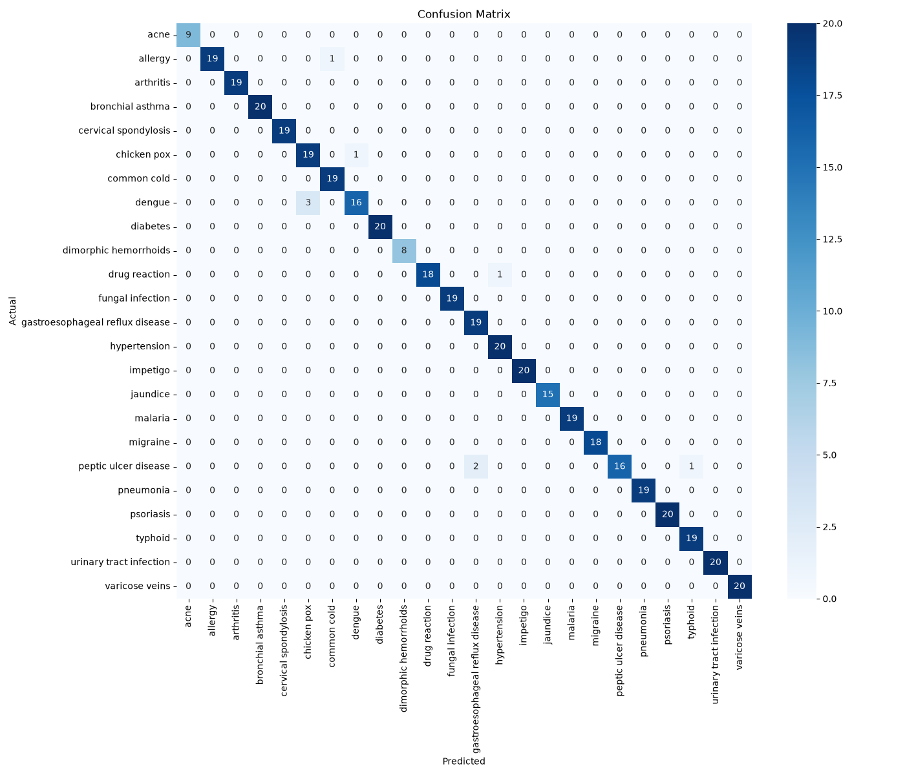

# 🩺 Disease Symptom Predictor

An NLP-based disease symptom prediction system that analyzes natural-language symptom descriptions and predicts the most likely disease using machine learning.

The project combines **Natural Language Processing (NLP), TF-IDF feature extraction, Machine Learning, and Flask** to provide a simple web-based symptom prediction interface.

> ⚠️ **Disclaimer:** This project is intended for educational and research purposes only. It is **not a medical diagnostic tool** and should not be used as a substitute for professional medical advice.

---

## 🚀 Project Overview

Instead of selecting symptoms from a fixed list, users can describe their symptoms naturally, for example:

> "I have a headache with nausea and sensitivity to light."

The system processes the text, converts it into numerical features using **TF-IDF**, and uses a trained **Logistic Regression classifier** to predict one of the diseases represented in the dataset.

### Pipeline

```text
User Symptom Description
          ↓
     Text Preprocessing
          ↓
       TF-IDF
          ↓
Machine Learning Model
          ↓
   Disease Prediction
          ↓
      Flask Web App
```

---

## ✨ Features

* 🧠 Natural-language symptom input
* 🔤 NLP-based text processing
* 📊 TF-IDF feature extraction
* 🤖 Machine-learning disease classification
* 🌐 Flask web interface
* 📈 Model performance evaluation
* 🔍 Confusion matrix analysis
* 🧪 Comparison of multiple ML approaches
* 🧬 Experimental sentence-embedding approach
* 📁 Modular project structure

---

## 📊 Dataset

The project uses the **Symptom2Disease** dataset.

### Dataset Statistics

| Property         | Value |
| ---------------- | ----: |
| Total samples    | 1,200 |
| Disease classes  |    24 |
| Training samples |   960 |
| Testing samples  |   240 |
| TF-IDF features  | 5,000 |

The dataset contains natural-language symptom descriptions paired with corresponding disease labels.

---

## 🤖 Machine Learning

### 1. TF-IDF + Logistic Regression

The primary model uses:

* **TF-IDF Vectorizer**
* **Logistic Regression**

The text is transformed into a 5,000-dimensional TF-IDF representation before being passed to the classifier.

### Performance

**Accuracy: 95.83%**

The model is evaluated using a separate test set.

---

### 2. Multinomial Naive Bayes

A second traditional NLP classification approach was evaluated for comparison.

**Accuracy: 95.83%**

This provides a useful baseline for comparing different text-classification algorithms.

---

### 3. Sentence Embeddings Experiment

An additional experiment was performed using sentence embeddings to investigate whether semantic representations could improve disease classification.

**Accuracy: 90.42%**

In this dataset and experimental setup, the TF-IDF-based approach performed better than the embedding-based approach.

This comparison demonstrates an important practical point: **more advanced representations do not automatically produce better results on every dataset.**

---

## 📈 Model Comparison

| Model                   | Feature Representation |   Accuracy |
| ----------------------- | ---------------------- | ---------: |
| Logistic Regression     | TF-IDF                 | **95.83%** |
| Multinomial Naive Bayes | TF-IDF                 | **95.83%** |
| Embedding-based Model   | Sentence Embeddings    | **90.42%** |

### Key Observation

The TF-IDF-based models achieved the highest accuracy in the current experiment.

The embedding approach performed lower, suggesting that model performance depends heavily on the dataset, representation, preprocessing, and classifier configuration.

---

## 🔍 Error Analysis

A **confusion matrix** is included in the project to analyze classification performance across the 24 disease classes.

The confusion matrix helps identify:

* Correctly classified diseases
* Frequently confused disease classes
* Classes with weaker classification performance
* Areas where additional data or improved preprocessing may help

### Confusion Matrix



---

## 🌐 Flask Web Application

The trained model is integrated into a Flask web application.

Users can enter symptoms in natural language through a web interface.

### Example

**Input:**

```text
I have a headache with nausea and sensitivity to light.
```

The application processes the input through the trained NLP pipeline and returns a predicted disease.

> The prediction should be treated as a machine-learning output, not a medical diagnosis.

---

## 🗂️ Project Structure

```text
disease-symptom-predictor/
│
├── src/
│   ├── app.py
│   ├── train_model.py
│   ├── merge_data.py
│   └── train_model_embeddings.py
│
├── templates/
│   └── index.html
│
├── data/
│   └── Symptom2Disease.csv
│
├── confusion_matrix.png
├── requirements.txt
├── .gitignore
└── README.md
```

### Important Files

| File                            | Description                    |
| ------------------------------- | ------------------------------ |
| `src/app.py`                    | Flask web application          |
| `src/train_model.py`            | Model training and evaluation  |
| `src/merge_data.py`             | Dataset preparation/merging    |
| `src/train_model_embeddings.py` | Embedding-based experiment     |
| `templates/index.html`          | Web interface                  |
| `confusion_matrix.png`          | Model evaluation visualization |
| `requirements.txt`              | Python dependencies            |

---

## 🛠️ Technologies Used

### Programming

* Python
* HTML
* CSS

### Machine Learning

* Scikit-learn
* Logistic Regression
* Multinomial Naive Bayes

### NLP

* TF-IDF
* Text preprocessing
* Sentence embeddings

### Data Processing

* Pandas
* NumPy

### Visualization

* Matplotlib

### Web Development

* Flask
* Jinja2
* HTML/CSS

---

## ⚙️ Installation

### 1. Clone the repository

```bash
git clone https://github.com/aniruddhasutradher07-commits/disease-symptom-predictor.git
```

### 2. Navigate to the project

```bash
cd disease-symptom-predictor
```

### 3. Create a virtual environment

```bash
python -m venv venv
```

### 4. Activate the virtual environment

#### macOS / Linux

```bash
source venv/bin/activate
```

#### Windows

```bash
venv\Scripts\activate
```

### 5. Install dependencies

```bash
pip install -r requirements.txt
```

---

## ▶️ Running the Project

### Train the model

```bash
python src/train_model.py
```

This generates the trained model and TF-IDF vectorizer.

### Start the Flask application

```bash
python src/app.py
```

Then open:

```text
http://127.0.0.1:5000/
```

in your browser.

---

## 🧪 Running the Embedding Experiment

To run the experimental embedding-based approach:

```bash
python src/train_model_embeddings.py
```

This script is included to compare semantic embedding representations against the traditional TF-IDF approach.

---

## 📦 Model Files

The trained model artifacts include:

```text
model.pkl
vectorizer.pkl
```

These files are generated from the training pipeline.

They are intentionally treated as generated artifacts in the current development workflow rather than being required as source code.

To recreate them, run:

```bash
python src/train_model.py
```

---

## 🔬 Methodology

The overall workflow consists of the following stages:

### 1. Data Collection

Natural-language symptom descriptions and disease labels are obtained from the Symptom2Disease dataset.

### 2. Data Preprocessing

The dataset is cleaned and prepared for machine-learning training.

### 3. Text Vectorization

TF-IDF converts symptom descriptions into numerical feature vectors.

### 4. Model Training

Machine-learning classifiers are trained using the transformed text data.

### 5. Evaluation

The models are evaluated using a held-out test set.

Metrics and visualizations are used to compare performance.

### 6. Deployment

The selected model is integrated into a Flask web application.

---

## 📌 Key Results

The current experimental results show:

```text
Dataset Size        : 1,200 samples
Disease Classes     : 24
Training Set        : 960 samples
Testing Set         : 240 samples
TF-IDF Features     : 5,000

Logistic Regression : 95.83%
Naive Bayes         : 95.83%
Embeddings          : 90.42%
```

The results indicate that traditional TF-IDF-based approaches performed strongly on the current dataset.

---

## 🔮 Future Improvements

Possible future improvements include:

* [ ] Add probability/confidence calibration
* [ ] Improve symptom preprocessing
* [ ] Handle spelling mistakes and abbreviations
* [ ] Add symptom normalization
* [ ] Experiment with Word2Vec and FastText
* [ ] Test transformer-based models such as BERT
* [ ] Increase dataset size and diversity
* [ ] Add explainable AI features
* [ ] Improve UI/UX
* [ ] Add REST API endpoints
* [ ] Containerize the application using Docker
* [ ] Deploy the Flask application
* [ ] Add automated testing
* [ ] Add CI/CD using GitHub Actions

---

## ⚠️ Limitations

This project has several limitations:

1. The model is trained on a relatively small dataset.
2. The prediction is limited to the disease classes present in the dataset.
3. Real-world medical symptoms can be significantly more complex.
4. The model does not perform clinical examination or laboratory testing.
5. Prediction accuracy on the dataset does not guarantee real-world medical accuracy.
6. The system should not be used for self-diagnosis or treatment decisions.

---

## 🎓 Educational Purpose

This project demonstrates the practical application of:

```text
Natural Language Processing
        +
Machine Learning
        +
Text Classification
        +
Model Evaluation
        +
Flask Deployment
```

It was developed as a learning project to explore how machine-learning techniques can be applied to healthcare-related text data.

---

## 👨‍💻 Author

**Aniruddha Sutradhar**

B.Tech Biotechnology

Interests:

* Machine Learning
* Bioinformatics
* Biotechnology
* Healthcare AI
* NLP
* Data Science

---

## 📜 Disclaimer

This project is intended **strictly for educational and research purposes**.

The predicted disease is generated by a machine-learning model and should **not** be considered a medical diagnosis.

Always consult a qualified healthcare professional for medical advice, diagnosis, or treatment.

---

## ⭐ If You Find This Project Interesting

Feel free to explore the code, experiment with different NLP techniques, and improve the model.

If you find the project useful, consider giving the repository a ⭐ on GitHub.
